# Modelo De Dominio

Documento de diseño del modelo de la Practica 2.

## Vision General Del Modelo

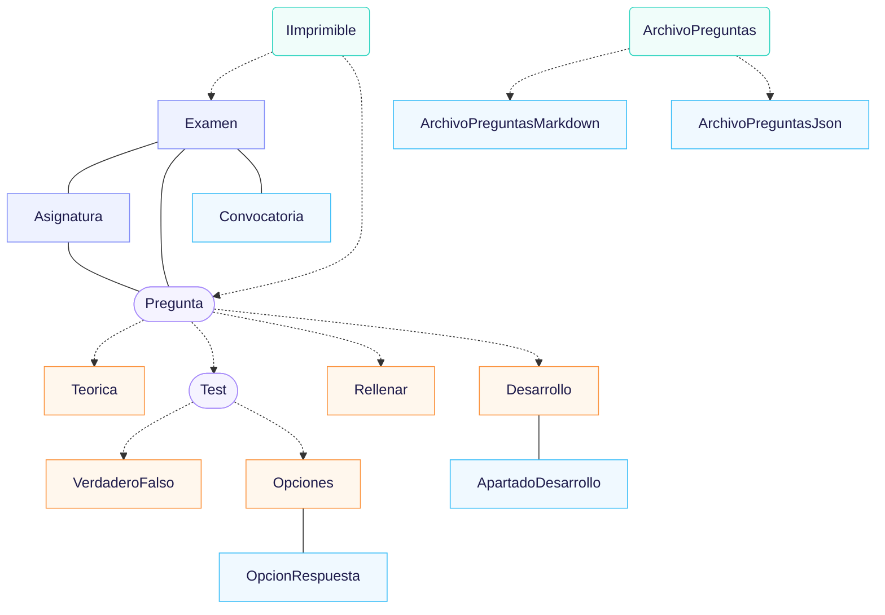


## Interfaz De Impresión

El contrato `IImprimible` define la forma publica de imprimir objetos
del dominio.

`imprimirSimple()` es el caso seguro por defecto:
no muestra respuestas.
`imprimirCompleto()` se usa cuando se quieren revisar
las respuestas correctas.

Ademas,
la interfaz incluye atajos `imprimir()`
e `imprimir(boolean incluirRespuestas)` 
par abstraer ambos métodos en una llamada.

```
String imprimirSimple()
String imprimirCompleto()
String imprimir()
String imprimir(boolean incluirRespuestas)
```

El booleano `incluirRespuestas`
equivale a imprimir con respuestas.

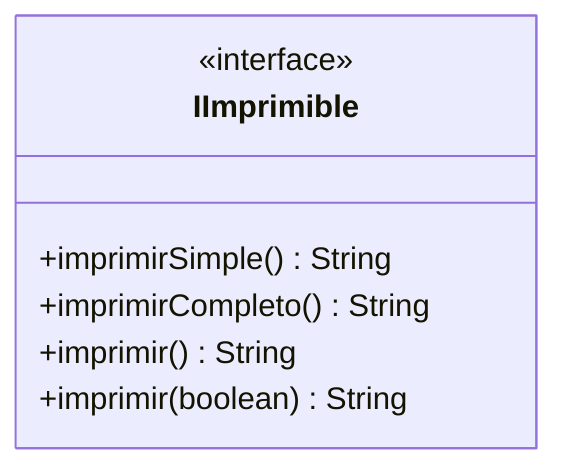


## Clase Asignatura

Modela una asignatura para asociar a las preguntas
y examenes.

Almacena el codigo,
el titulo,
la lista de preguntas contenidas en la carpeta propia.

Se utiliza en el *filesystem* que organiza estas preguntas. 
La separación en carpetas por código de asignatura se se abstrae. 
Se busca resolver problemas de escala de cantidad de preguntas y
mantener la información organizada, además de facilitar la revisión manual
 y permitir añadir nuevas asignaturas sin mezclar sus preguntas.

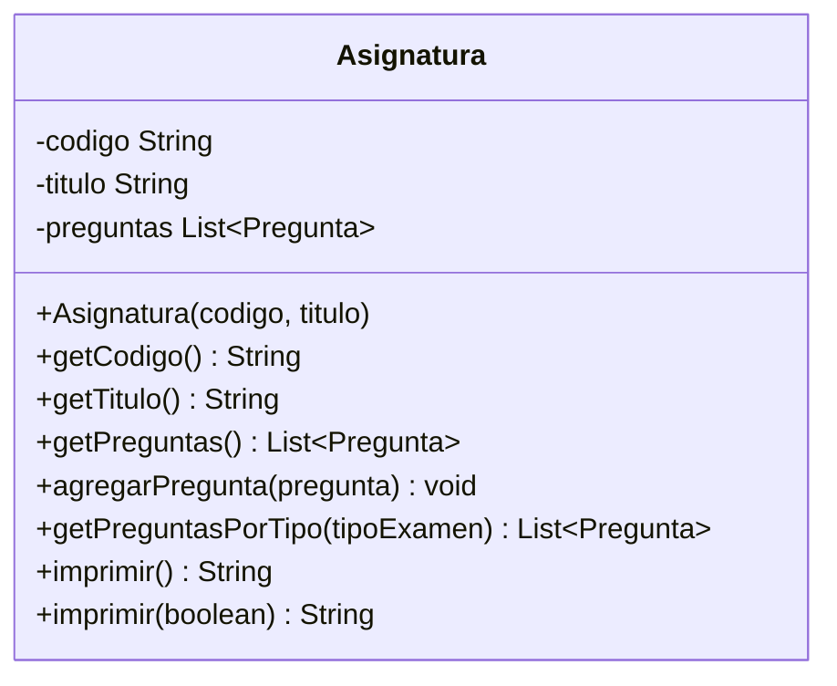


## Clase Examen

Representa un examen generado para el usuario.

Guarda los datos de cabecera,
la asignatura,
la convocatoria,
el curso,
el tipo de examen
y las preguntas seleccionadas.

Tambien guarda la puntuacion maxima del examen.
Por defecto sera `10.0`,
siguiendo la escala habitual del enunciado,
pero se deja como valor ajustable
para que el modelo no dependa de un numero mágico fijo.

Esta puntuacion maxima no representa una nota obtenida
por un alumno.
Solo indica sobre cuantos puntos se ponderan
las preguntas del examen.

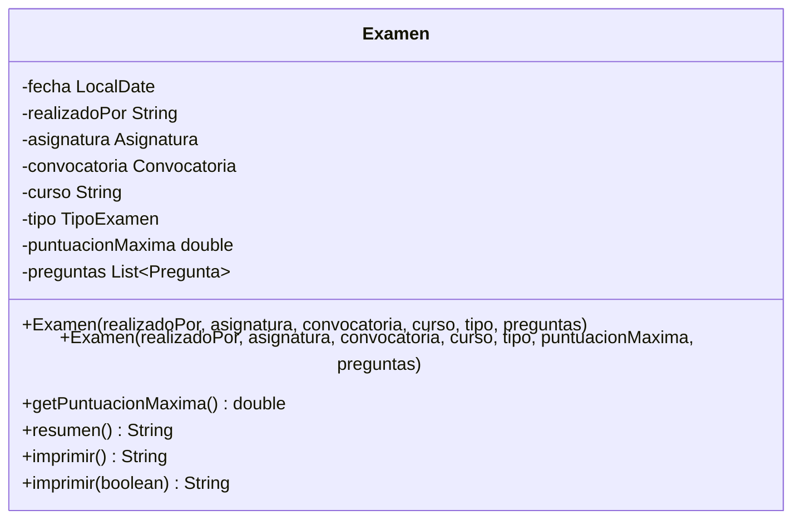


## Clase Pregunta

Clase abstracta comun para todos los tipos de pregunta.

Datos:

- texto,
- texto aclaratorio
- nota numerica.

La nota de una pregunta representa su valor maximo
dentro de un examen.
Se usa como ponderacion,
no como correccion de una respuesta de alumno.

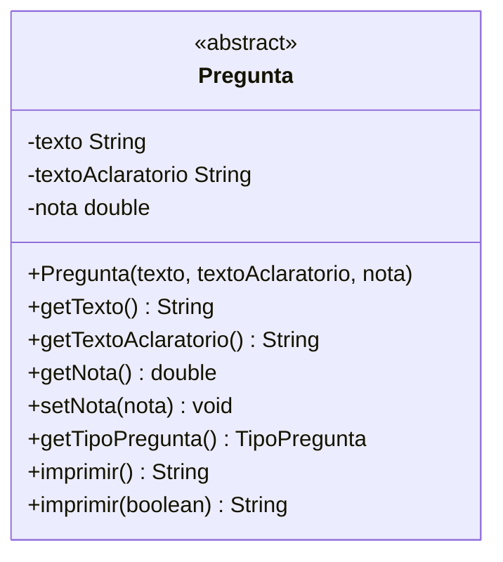


## Clase PreguntaTeorica

Pregunta con respuesta ejemplar correcta.

La respuesta solo debe aparecer en `imprimir(true)`.

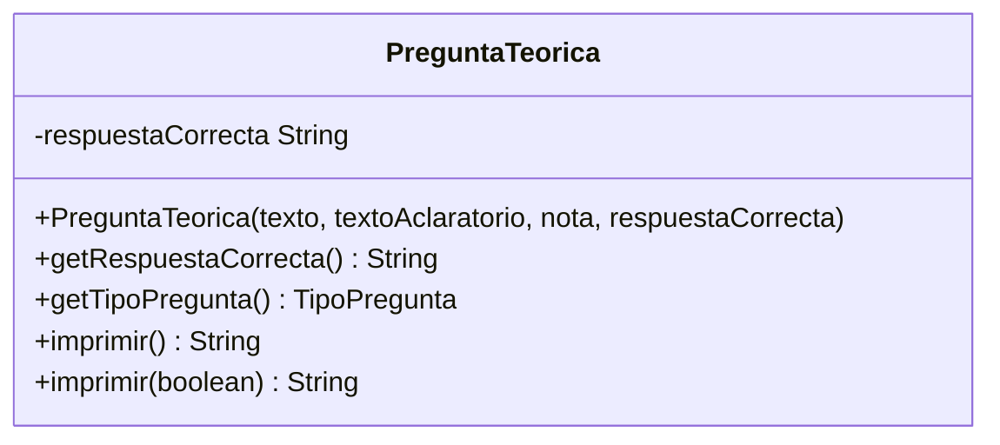


## Clase PreguntaTest

Clase abstracta para preguntas tipo test.

Centraliza la regla de penalizacion por fallo,
comun a verdadero/falso
y listado de opciones.

La penalizacion es un valor numérico que se resta en fallo. 
Un valor `0.0` significa que la pregunta no penaliza. Valor por defecto. 
Un valor mayor que `0.0` indica cuantos puntos se penalizarian
si la respuesta fuese incorrecta.

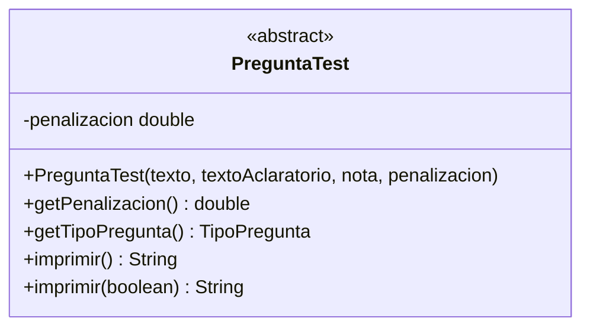


## Clase PreguntaVerdaderoFalso

Pregunta test con dos posibles respuestas:
verdadero
o falso.

La respuesta correcta no aparece en el modo simple.

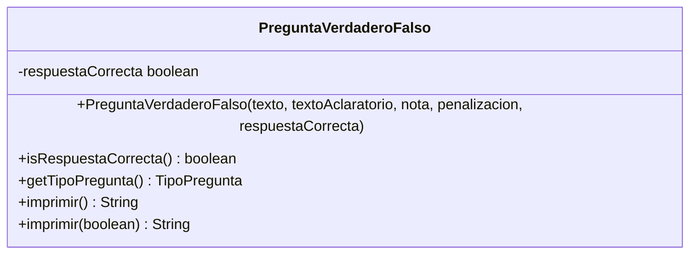


## Clase PreguntaOpciones

Pregunta test con varias opciones posibles.

Cada opcion conoce si es correcta,
pero esa informacion solo se imprime en modo completo.

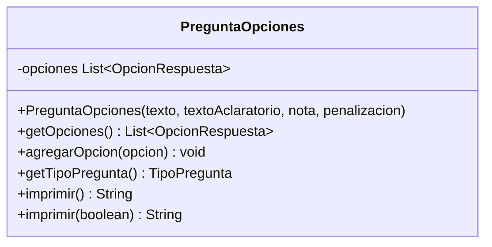


## Clase OpcionRespuesta

Valor asociado a `PreguntaOpciones`.

No es una pregunta completa.
Solo representa una opcion concreta.

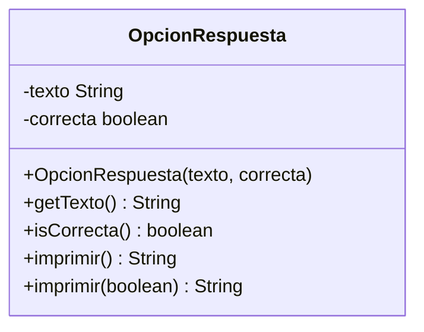


## Clase PreguntaRellenar

Pregunta basada en una frase con huecos,
representados por `?`,
y una lista ordenada de palabras correctas.

Las palabras correctas solo aparecen en modo completo.

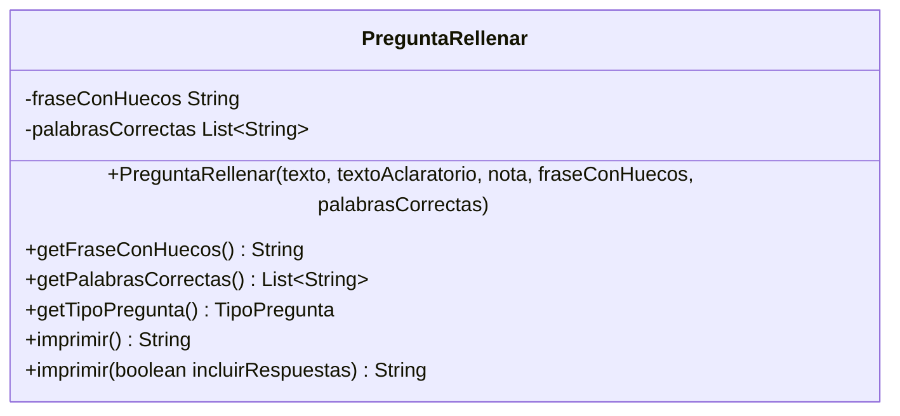


## Clase PreguntaDesarrollo

Pregunta practica o de desarrollo.

Se compone de apartados.
Cada apartado aporta un porcentaje sobre la nota total
de la pregunta.

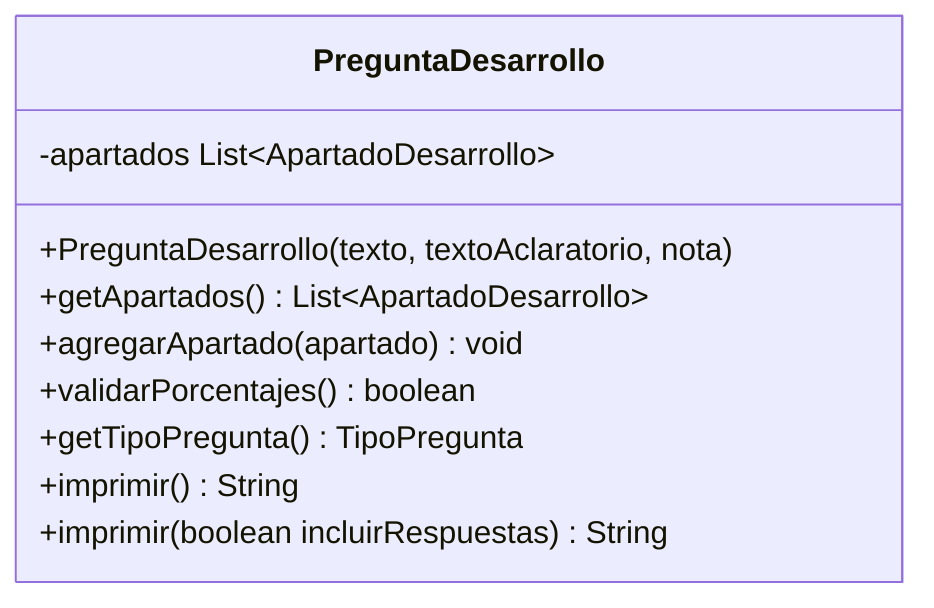


## Clase ApartadoDesarrollo

Valor asociado a `PreguntaDesarrollo`.

Representa una parte evaluable de la pregunta.

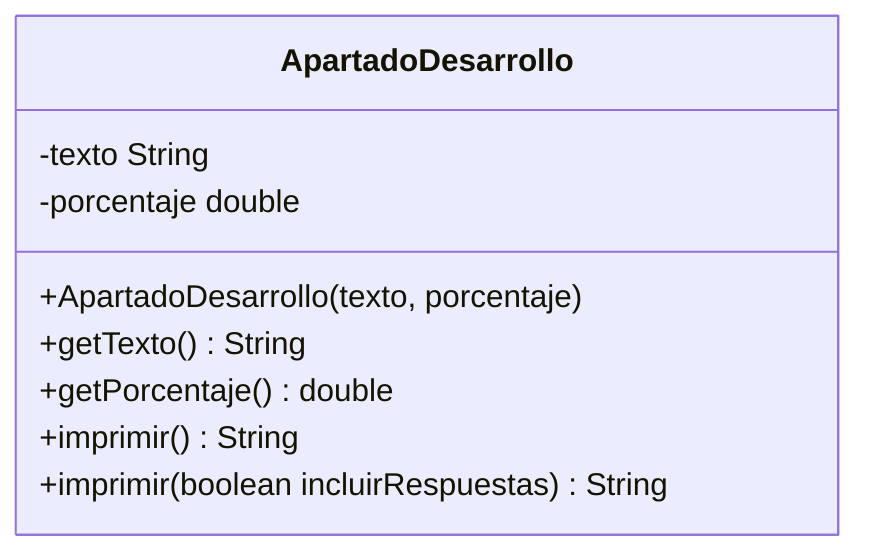


## Enumeracion Convocatoria

Valores validos de convocatoria exigidos por el enunciado.

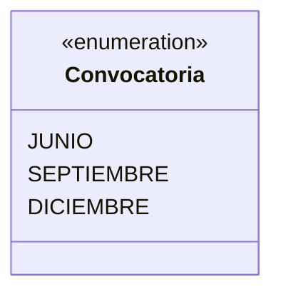


## Enumeracion TipoExamen

Controla las reglas de composicion del examen.

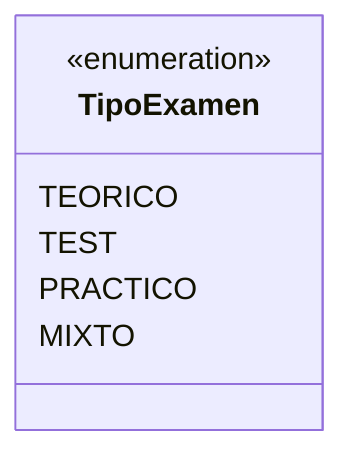


## Enumeracion TipoPregunta

Permite clasificar preguntas sin depender de clases concretas
en el flujo de consola.

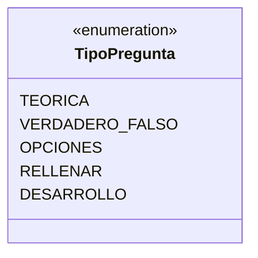


## Relacion: Impresion Del Dominio

`Asignatura`,
`Examen`
y todas las preguntas son imprimibles.

El contrato evita que la consola necesite conocer detalles internos
de cada clase.

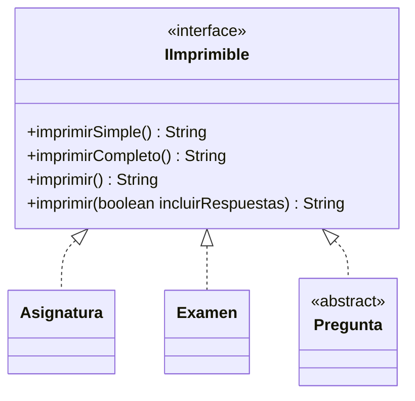


## Relacion: Asignatura Y Preguntas

Una asignatura agrupa preguntas.

La pregunta no necesita conocer directamente a su asignatura,
lo que mantiene bajo el acoplamiento del modelo.

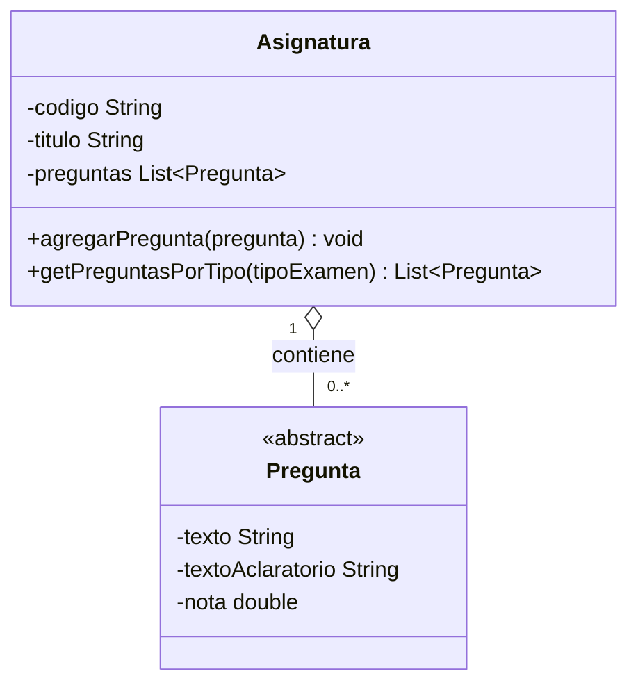


## Relacion: Examen, Asignatura Y Preguntas

Un examen pertenece a una asignatura
y contiene una seleccion de preguntas de esa asignatura.

La seleccion se realiza fuera del constructor,
para poder validar disponibilidad
y repartir notas despues.

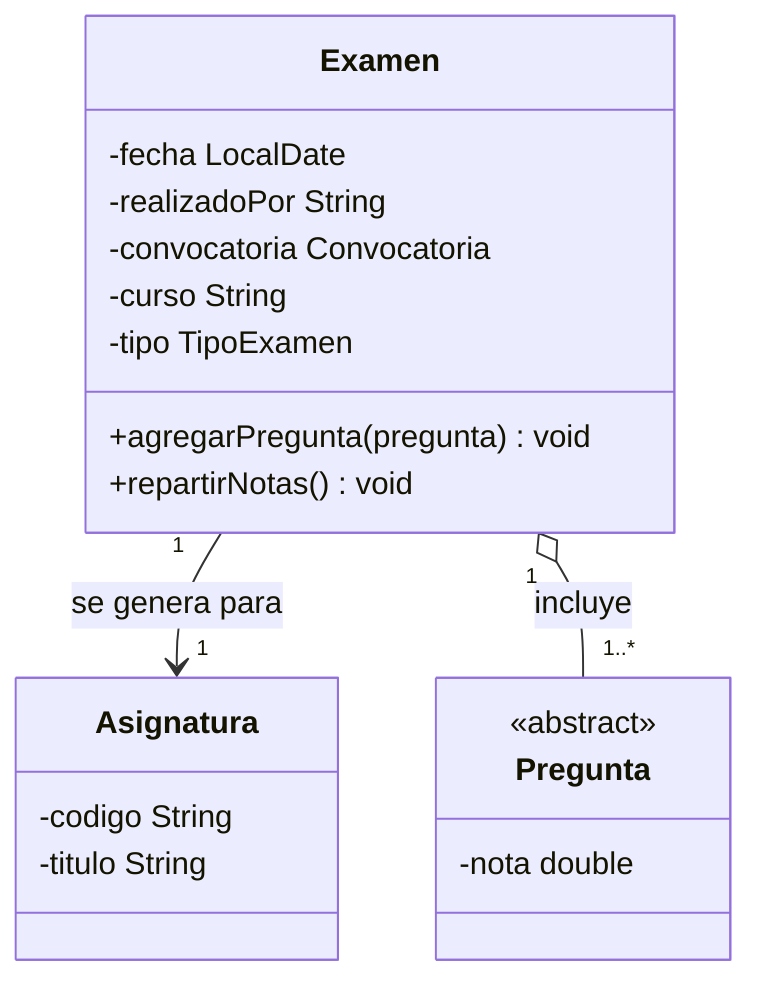


## Relacion: Jerarquia De Preguntas

La clase `Pregunta` define los datos comunes.

Cada subtipo solo incorpora los datos especificos
que exige el enunciado.

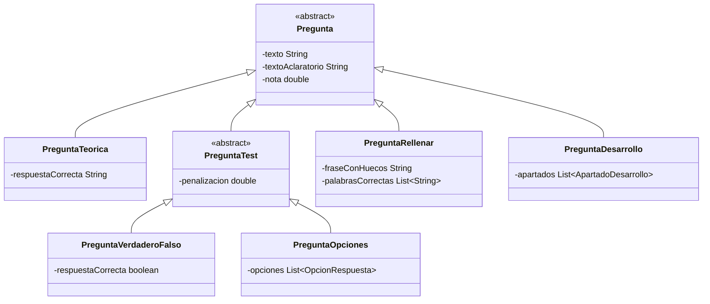


## Relacion: Pregunta De Opciones

`PreguntaOpciones` se compone de varias `OpcionRespuesta`.

La opcion es un objeto separado para evitar listas paralelas
de textos
y valores booleanos.

```mermaid
classDiagram
    PreguntaOpciones "1" o-- "2..*" OpcionRespuesta : contiene

    class PreguntaOpciones {
        -opciones List~OpcionRespuesta~
        +agregarOpcion(opcion) void
        +imprimir() String
        +imprimir(boolean incluirRespuestas) String
    }

    class OpcionRespuesta {
        -texto String
        -correcta boolean
        +imprimir() String
        +imprimir(boolean incluirRespuestas) String
    }
```


## Relacion: Pregunta De Desarrollo

`PreguntaDesarrollo` se compone de apartados.

La suma de porcentajes debe ser `100`.

```mermaid
classDiagram
    PreguntaDesarrollo "1" o-- "1..*" ApartadoDesarrollo : contiene

    class PreguntaDesarrollo {
        -apartados List~ApartadoDesarrollo~
        +agregarApartado(apartado) void
        +validarPorcentajes() boolean
    }

    class ApartadoDesarrollo {
        -texto String
        -porcentaje double
    }
```


## Relacion: Tipos Y Reglas De Composicion

`TipoExamen` decide que preguntas son compatibles.

No es una clase con estado.
Es una enumeracion porque el PDF define un conjunto cerrado:
teorico,
test,
practico
y mixto.

La regla de seleccion
y reparto de notas
debe vivir en un componente de generacion
o en un metodo aislado de seleccion,
no dentro de `Examen`.

El reparto de notas se calcula respecto a la puntuacion maxima
del examen.
El valor por defecto es `10.0`.
Si se usa otro valor,
las mismas reglas se aplican sobre esa puntuacion maxima.

```mermaid
classDiagram
    Examen --> TipoExamen : registra
    Pregunta --> TipoPregunta : expone
    Asignatura --> TipoExamen : filtra preguntas para

    class TipoExamen {
        <<enumeration>>
        TEORICO
        TEST
        PRACTICO
        MIXTO
    }

    class TipoPregunta {
        <<enumeration>>
        TEORICA
        VERDADERO_FALSO
        OPCIONES
        RELLENAR
        DESARROLLO
    }
```


## Relacion: Archivo De Preguntas Persistidas

Las preguntas se almacenan en ficheros legibles
por asignatura.

El dominio no depende del formato concreto del fichero.
Para conseguirlo,
la lectura y escritura se definen mediante el contrato
`ArchivoPreguntas`.

`ArchivoPreguntas` transforma un fichero de preguntas
en una lista de objetos `Pregunta`
y tambien puede escribir una lista de preguntas
de vuelta al fichero.
El resto del programa no necesita saber
si el fichero esta escrito en Markdown,
JSON
u otro formato futuro.

La implementacion principal sera `ArchivoPreguntasMarkdown`,
porque el formato Markdown limitado es facil de revisar
y editar por una persona.

Tambien se modela `ArchivoPreguntasJson`
como implementacion alternativa.
Su objetivo es demostrar que el diseno no esta atado a Markdown:
si se quisiera cambiar a JSON,
solo habria que cambiar la implementacion de `ArchivoPreguntas`
sin modificar las clases del dominio.

```mermaid
classDiagram
    RepositorioPreguntas --> ArchivoPreguntas : lee/escribe mediante contrato
    ArchivoPreguntas <|.. ArchivoPreguntasMarkdown
    ArchivoPreguntas <|.. ArchivoPreguntasJson
    ArchivoPreguntas --> Pregunta : transforma lista
    RepositorioPreguntas --> FormatoPreguntas : configura formato

    class ArchivoPreguntas {
        <<interface>>
        +leer(ruta) List~Pregunta~
        +escribir(ruta, preguntas) void
    }

    class ArchivoPreguntasMarkdown {
        +leer(ruta) List~Pregunta~
        +escribir(ruta, preguntas) void
    }

    class ArchivoPreguntasJson {
        +leer(ruta) List~Pregunta~
        +escribir(ruta, preguntas) void
    }

    class RepositorioPreguntas {
        +cargar(asignatura) List~Pregunta~
        +guardar(asignatura) void
    }
```


La seleccion de formato puede representarse con una enumeracion sencilla:

```mermaid
classDiagram
    class FormatoPreguntas {
        <<enumeration>>
        MARKDOWN
        JSON
    }
```


Regla de diseno:

- `ArchivoPreguntas` es el contrato estable.
- `ArchivoPreguntasMarkdown` conoce solo el formato Markdown limitado.
- `ArchivoPreguntasJson` conoce solo el formato JSON.
- `RepositorioPreguntas` coordina carga y guardado,
pero trabaja con el contrato `ArchivoPreguntas`.
- `Asignatura`,
`Examen`
y `Pregunta`
no conocen Markdown,
JSON
ni rutas concretas.

## Reglas Importantes Del Modelo

- `Pregunta` es abstracta porque no existe una pregunta generica
instanciable en el enunciado.
- `PreguntaTest` tambien es abstracta porque el PDF exige subtipos
concretos.
- `imprimir()` nunca muestra respuestas correctas.
- `imprimir(true)` muestra todos los datos necesarios para revisar
el examen.
- `Examen`. Entidad Pasiva. 
Guarda preguntas ya seleccionadas
y puntuadas.
- `TipoExamen` existe porque el PDF obliga a distinguir reglas de
composicion:
teorico,
test,
practico
y mixto.
- La puntuacion maxima de un examen es `10.0` por defecto,
pero puede ajustarse si se quiere generar un examen sobre otra escala.
- La nota de cada pregunta indica su valor maximo dentro del examen,
no una calificacion obtenida por un alumno.
- En un examen mixto sobre `10.0`,
debe existir una pregunta de desarrollo con valor `4`.
- En examenes no mixtos,
la puntuacion maxima se reparte por igual entre preguntas.
- `PreguntaDesarrollo` debe validar que sus apartados suman `100`.
- `Asignatura` es la raiz natural para localizar preguntas disponibles.
- Las preguntas se persisten por asignatura
en `files/preguntas/<codigo>/preguntas.md`.
- La clasificacion fisica por carpetas pertenece
a `RepositorioPreguntas`,
no a `Asignatura`.
- El formato Markdown se aísla detras de `ArchivoPreguntas`.
 Cambiar a JSON implica usar `ArchivoPreguntasJson`,
no modificar el dominio.

## Resumen De Responsabilidades


| Elemento                  | Responsabilidad                                                           |
| ------------------------- | ------------------------------------------------------------------------- |
| `IImprimible`             | Contrato comun de impresion simple y completa.                            |
| `Asignatura`              | Agrupa preguntas por codigo y titulo.                                     |
| `Examen`                  | Guarda cabecera, asignatura y preguntas seleccionadas.                    |
| `Pregunta`                | Define datos comunes de cualquier pregunta.                               |
| `PreguntaTeorica`         | Guarda respuesta ejemplar correcta.                                       |
| `PreguntaTest`            | Define comportamientos de preguntas tipo test .                           |
| `PreguntaVerdaderoFalso`  | Modela test binario.                                                      |
| `PreguntaOpciones`        | Modela test con varias opciones.                                          |
| `OpcionRespuesta`         | Guarda texto de opcion y si es correcta.                                  |
| `PreguntaRellenar`        | Guarda frase con huecos y palabras correctas.                             |
| `PreguntaDesarrollo`      | Agrupa apartados practicos evaluables.                                    |
| `ApartadoDesarrollo`      | Guarda texto y porcentaje de un apartado.                                 |
| `Convocatoria`            | Limita convocatorias validas.                                             |
| `TipoExamen`              | Limita tipos de examen validos.                                           |
| `TipoPregunta`            | Limita tipos de pregunta validos.                                         |
| `RepositorioPreguntas`      | Guarda y carga preguntas en carpetas separadas por asignatura.              |
| `ArchivoPreguntas`          | Contrato para leer y escribir preguntas sin exponer el formato del fichero. |
| `ArchivoPreguntasMarkdown`  | Lee y escribe el formato Markdown limitado elegido para usuarios.            |
| `ArchivoPreguntasJson`      | Lee y escribe una alternativa JSON sin cambiar el dominio.                   |
| `FormatoPreguntas`          | Limita los formatos soportados: Markdown o JSON.                            |


## Ampliacion Opcional: Sistema De Dificultad

`SistemaDificultad` no forma parte del modelo obligatorio del enunciado.
Se plantea como ampliacion para estimar
y actualizar la dificultad de las preguntas
a partir de experimentos.

No corrige examenes completos, ni calcula la nota final de un alumno.
Su responsabilidad es establecer una medida de dificultad
para cada pregunta
y actualizarla con sesiones de prueba controladas.

La dificultad de cada pregunta se guarda como un valor entre `0.0`
y `1.0`.
Ese valor se interpreta como porcentaje normalizado:

- `0.0` equivale a `0%`;
- `0.5` equivale a `50%`;
- `1.0` equivale a `100%`.

Al crear una pregunta,
su dificultad inicial es `0.5`,
porque aun no hay evidencia suficiente
para considerarla facil o dificil.
En el fichero Markdown aparece como metadato:

```text
> dificultad: 0.5
```

`TestTester` es el programa auxiliar de la ampliacion.
Puede ejecutarse de forma independiente al flujo normal
de creacion de examenes.

El flujo previsto es:

- pedir el codigo de una asignatura;
- seleccionar una asignatura concreta;
- no mezclar asignaturas,
porque la maestria del tester solo tiene sentido
dentro de una materia;
- seleccionar `N` preguntas para probar;
- recoger respuestas objetivas en preguntas deterministas;
- pedir una valoracion subjetiva de dificultad
en preguntas libres o de desarrollo;
- actualizar la dificultad historica de las preguntas probadas;
- escribir de nuevo el fichero de preguntas
  para persistir el metadato `dificultad` actualizado.

El usuario de esta prueba se modela como `SujetoTester`.
No tiene que ser necesariamente un alumno real:
puede ser otro profesor,
un alumno colaborador
o cualquier persona usada para validar preguntas.

El `SujetoTester` tambien tiene una maestria estimada, entre `0.0`
y `1.0`.
Empieza en `0.5`.
Durante la sesion,
su maestria se actualiza con las preguntas deterministas:

- si acierta muchas,
se acerca a `1.0`;
- si falla muchas,
se acerca a `0.0`;
- si queda cerca de `0.5`,
se considera un tester más informativo.

La idea es no dar demasiado peso
a testers extremos:

- quien acierta todo puede conocer ya las respuestas;
- quien falla todo puede no servir para estimar la dificultad;
- quien queda cerca de `0.5` aporta maxima incertidumbre
y es mas util para calibrar.

Para explicar la regla se usan estos valores:

- `M`: maestria estimada del `SujetoTester`;
- `X`: utilidad del tester;
- `D`: dificultad actual de la pregunta.

La utilidad `X` se calcula con una regla simple:

```text
X = 4 * M*(1-M)
```

Por tanto:

- si `M` esta cerca de `0.5`,
`X` se acerca a `1.0`;
- si `M` esta cerca de `0.0` o `1.0`,
`X` se acerca a `0.0`.

Para preguntas deterministas,
la actualizacion solo se hace cuando el resultado aporta informacion:

- Si el tester falla una pregunta que parecia mas facil que su nivel,  
la dificultad sube.
- Si el tester acierta una pregunta que parecia mas dificil que su nivel,  
la dificultad baja.
- Si el resultado era esperable,  
la dificultad no cambia.
- La actualización sigue la formula:

```text
D = ((10.0-X)*D + X*M)/10.0

Guardarrailes opcionales:
D = min(D,1)
D = max(D,0)
```

Para preguntas libres o de desarrollo,
el tester no introduce una respuesta automaticamente corregible.
En su lugar,
indica del `1` al `10`
como de dificil considera la pregunta.
Esa valoracion se convierte a escala `0.0` a `1.0`
y se combina con la dificultad anterior,
ponderada por `X`.

Despues de actualizar `D`,
`SistemaDificultad` modifica la dificultad de la pregunta
y `TestTester` solicita a `RepositorioPreguntas`
que guarde la lista completa.
El repositorio usa `ArchivoPreguntas`
para escribir el fichero en el formato configurado.

```mermaid
classDiagram
    TestTester --> SistemaDificultad : usa
    TestTester --> SujetoTester : estima maestria
    TestTester --> ResultadoPrueba : crea
    TestTester --> RepositorioPreguntas : persiste dificultad
    RepositorioPreguntas --> ArchivoPreguntas : escribe metadatos
    SistemaDificultad --> Pregunta : actualiza dificultad
    ResultadoPrueba --> Pregunta : corresponde a
    ResultadoPrueba --> SujetoTester : realizado por

    class SistemaDificultad {
        +registrarResultado(resultado) void
        +calcularDificultad(pregunta) double
        +calcularUtilidadTester(sujetoTester) double
        +actualizarDificultad(pregunta, resultado) void
    }

    class TestTester {
        +ejecutarSesion(codigoAsignatura, numeroPreguntas) void
        +seleccionarPreguntas(codigoAsignatura, numeroPreguntas) List~Pregunta~
        +recogerResultado(pregunta, sujetoTester) ResultadoPrueba
    }

    class RepositorioPreguntas {
        +guardar(asignatura) void
    }

    class ArchivoPreguntas {
        <<interface>>
        +escribir(ruta, preguntas) void
    }

    class SujetoTester {
        -nombre String
        -maestria double
        -preguntasRespondidas int
        -preguntasAcertadas int
        +registrarAcierto() void
        +registrarFallo() void
        +getMaestria() double
    }

    class ResultadoPrueba {
        -pregunta Pregunta
        -sujetoTester SujetoTester
        -acertada boolean
        -tieneRespuestaObjetiva boolean
        -valoracionSubjetiva int
    }

    class Pregunta {
        <<abstract>>
        -texto String
        -nota double
        -dificultad double
        +getDificultad() double
        +setDificultad(dificultad) void
    }
```


### Responsabilidad De La Ampliacion


| Elemento            | Responsabilidad                                                          |
| ------------------- | ------------------------------------------------------------------------ |
| `SistemaDificultad` | Actualiza y calcula la dificultad historica de una pregunta.             |
| `TestTester`        | Ejecuta sesiones de prueba para calibrar preguntas.                      |
| `SujetoTester`      | Representa a la persona que prueba las preguntas y su maestria estimada. |
| `ResultadoPrueba`   | Guarda el resultado observado de una pregunta en una sesion de prueba.   |


- Metodo de actualizacion elegido:
media ponderada simple.
La dificultad se mueve poco a poco
hacia la evidencia observada,
ponderada por la utilidad `X` del tester.

